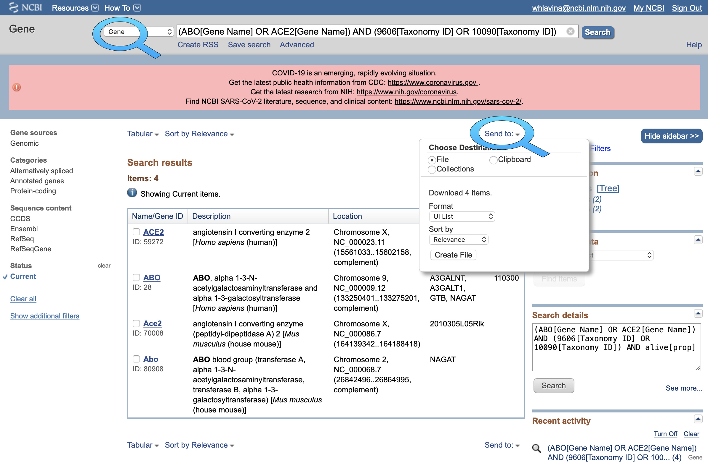
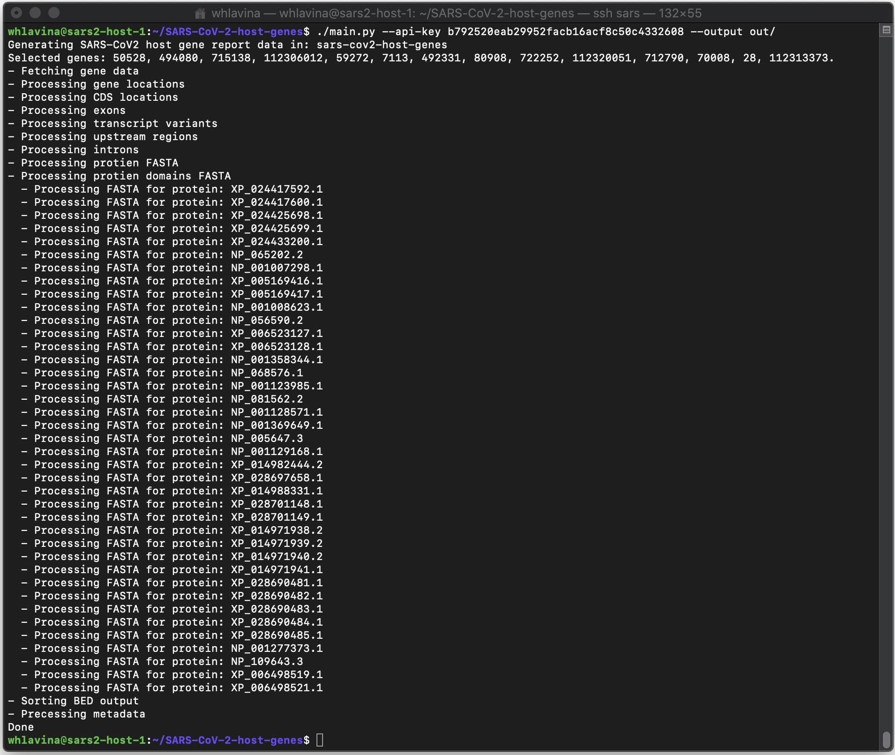

# Characterization of SARS-CoV-2 host genes
Datasets Codeathon Team II.

### Team members
Andrew Kim  
Bart Trawick  
Catherine Farrell  
Pooja Strope  
Wratko Hlavina  
Xuan Zhang  

## Introduction
The study of SARS-CoV-2 has become a significant interest for human health research, and has drawn attention to the human genes associated with SARS-CoV-2 entry. Users are therefore interested in retrieving as much information as possible about these host genes and their products, e.g. ACE2 encoding the SARS-CoV-2 spike protein receptor or TMPRSS2 encoding a protease that facilitates viral entry. In order to facilitate study of SARS-CoV-2 host genes, a comprehensive report of key features of structural annotation will be produced from this Codeathon, and will also include key metadata for these genes, such as nomenclature, summaries or associated publications. Since study of these genes in model organisms is also of interest to researchers, information on the orthologous genes in a select set of organisms will also be produced. The overriding goal will be to provide data from various NCBI resources (e.g. [Gene](https://www.ncbi.nlm.nih.gov/gene/), [RefSeq](https://www.ncbi.nlm.nih.gov/refseq/), [Nucleotide](https://www.ncbi.nlm.nih.gov/nucleotide/), [Protein](https://www.ncbi.nlm.nih.gov/protein/) records) in a succinct tabular format, such that the user can quickly retrieve multiple types of high-interest information about these genes in one place.

## Requirements
* Python version 3.7 or above
* [NCBI E-Utils](https://www.ncbi.nlm.nih.gov/books/NBK25501/)

## Quick Start
After cloning or downloading this repository, you will need to:
* _Pre-requisite:_ Install [NCBI E-Utils](https://www.ncbi.nlm.nih.gov/books/NBK25501/)
* _Optional but recommended:_ Create a Python virtual environment.
* _Optional but recommended:_ Create an NCBI API Key. See [A General Introduction to the E-utilities](https://www.ncbi.nlm.nih.gov/books/NBK25497/) and [NCBI Insights: New API Keys for the E-utilities](https://ncbiinsights.ncbi.nlm.nih.gov/2017/11/02/new-api-keys-for-the-e-utilities/) for an explanation and instructions.
* Install Python library dependencies
* Run the application, `main.py`, optionally with a list of Gene IDs of interest; output will be placed in the current directory (unless otherwise specified).
```
sh -c "$(wget -q ftp://ftp.ncbi.nlm.nih.gov/entrez/entrezdirect/install-edirect.sh -O -)"

python3 -m venv env
. env/bin/activate
pip install -r requirements.txt

./main.py -h
./main.py 59272 28 7113
```

## Scope
Genes to work on:

- ACE2
- ABO
- TMPRSS2

Organism/gene table:

|organism           | tax_id | ACE2     | ABO      | TMPRSS2  |
|:----------------- |:------ |:-------- |:-------- |:-------- |
|Human              |9606    |59272     |28        |7113      |
|Mouse              |10090   |70008     |80908     |50528     |
|Zebrafish          |7955    |492331    |-         |494080    |
|Rhesus monkey      |9544    |712790    |722252    |715138    |
|Common vampire bat |9430    |112313373 |112320051 |112306012 |

## Description of output contents

Output | Description | Data presentation
--- | --- | ---
location|genomic coordinates from most recent NCBI annotation|BED file
CDS|coordinates on the RefSeq transcript|BED file
exons|coordinates on the genome|BED file
transcript variants|coordinates on the genome (start to stop), with transcript identifier|BED file
protein sequences|proteins from RefSeq, with NP identifier|FASTA
protein domain annotation|domains or protein subparts (e.g signal, mature peptides) as annotated on protein flat files|FASTA
upstream regions|genomic coordinates of region 2 kb upstream of annotated transcription starts|BED file
introns|genomic coordinates for regions of transcript span that are not exonic|BED file
**Non-sequence metadata**|
summary|summary in Gene record|TSV file
gene symbols|primary gene symbol from Gene record|TSV file
gene aliases|aliases from Gene record|TSV file
primary description|primary description from Gene record|TSV file
other names|other names from Gene record|TSV file
publications|associated PubMed IDs from Gene record|TSV file
gene type|the type of gene from Gene record, e.g. protein-coding|TSV file
expression data|cell/tissue type expression data from Gene record|TSV file
GO terms|Gene Ontology terms on Gene record|TSV file

## Technical Implementation

This application uses [NCBI Datasets](https://www.ncbi.nlm.nih.gov/datasets/) to download
SARS-CoV-2 host gene information, augmented by the venerable [NCBI E-Utils](https://www.ncbi.nlm.nih.gov/books/NBK25501/),
and post-processes it to generate the desired output reports.

Key technical details include:
- Python is the primary implementation language for data retrieval and transformation.
- Portions of data retrieval and transformation use simple shell scripting; these may be migrated to Python in the future.
- The [NCBI Datasets API](https://github.com/ncbi/datasets) is used, directly via Python, to access the [OpenAPI REST interface](https://api.ncbi.nlm.nih.gov/datasets/v1alpha/).
- [Biopython](https://biopython.org) is used for manipulating genomic information in order to transform it and generate desired output.

    
### BED file specs
See UCSC's [Frequently Asked Questions: Data File Formats, BED format](http://genome.ucsc.edu/FAQ/FAQformat.html#format1) for list of standard columns and specifications. Here we use:

- 6-column BED format given the need to capture strand for genes and subfeatures
- RefSeq accession.version for column 1; also more explicit when multiple organisms are included in output
- 0-based start coordinates, 1-based end coordinates
- File sorting by column 1 primary, column 2 secondary (chr and start positions, `sort -k1,1 -k2,2n` on command line)
- Score (column 5) is irrelevant to this output but requires an integer, so value 1 is used here
- The GeneID is indicated in column 4, and may be joined via an underscore to other pertinent identifiable information for the feature. The name/label does not include spaces.
- The relevant strand in column 6 is indicated by either '+' or '-'. All gene-related features in this output are strand-specific.

### Non-sequence metadata	
* TSV file with one gene per row	
* Extracted from public resouces: esummary, efetch, elink	
* Progress:	
  * One gene	
  * Sample output:	
```angular2	
Summary: This gene encodes proteins related to the first discovered blood group system, ABO. Variation in the ABO gene (chromosome 9q34.2) is the basis of the ABO blood group, thus the presence of an allele determines the blood group in an individual. The 'O' blood group is caused by a deletion of guanine-258 near the N-terminus of the protein which results in a frameshift and translation of an almost entirely different protein. Individuals with the A, B, and AB alleles express glycosyltransferase activities that convert the H antigen into the A or B antigen. Other minor alleles have been found for this gene. [provided by RefSeq, Sep 2019]	
Symbol: ABO	
Aliases: A3GALNT, A3GALT1, GTB, NAGAT	
Description: ABO, alpha 1-3-N-acetylgalactosaminyltransferase and alpha 1-3-galactosyltransferase	
Type:  protein-coding	
Publications: 32093636, 31595994, 31487040, 31329303, 31260107, 31240718, 30859643, 30791881, 30549285, 30347622, 29873711, 29659952, 29457687, 29106707, 28984382, 28939368, 28833251, 28653406, 28256109, 27979997, 27542834, 27538125, 26924317, 26632894, 26512559, 26329815, 26268879, 26247473, 26244499, 26148378, 25854361, 25820620, 25656610, 25636112, 25297604, 25217989, 25156869, 25138306, 25064734, 24743543, 24510570, 23816557, 23387832, 23319424, 23300549, 22963146, 22642827, 22258027, 21729554, 21560847, 21306478, 20703243, 20677133, 20666915, 20576794, 20456702, 20371059, 20197725, 20154292, 20003128, 19648918, 19490215, 19470260, 19276450, 19078892, 19054377, 18712158, 18680548, 18651204, 18426679, 18273824, 18247104, 18156754, 18078207, 18067076, 18063521, 18003641, 17642512, 17531777, 17393014, 17311872, 17259183, 17130965, 17002642, 16871363, 16686846, 16686845, 16631357, 16403294, 16239542, 16215642, 16181218
```

### Datasets tool
See https://www.ncbi.nlm.nih.gov/datasets/docs/command-line-start/ for documentation on how to download and use this tool.

To obtain the specific GeneIDs used in this Codeathon (as in organism/gene table above), use:

```./datasets gene-descriptors gene-id 59272 28 7113 70008 80908 50528 492331 494080 712790 722252 715138 112313373 112320051 112306012|jq```

To download these genes to a file use:

```./datasets download gene 59272 28 7113 70008 80908 50528 492331 494080 712790 722252 715138 112313373 112320051 112306012```

### Sample usage

First, choose a set of Gene ID. You may use various resources to explore the available genes and organisms.
For example, if you have a set of gene names in mind, and a target set of organisms, you may use [NCBI Entrez Gene](https://www.ncbi.nlm.nih.gov/gene/), entering a suitable query and using the _Send to_ funtion to download the
list of Gene IDs.


Having selected your gene list, provide the file as input to the `main.py` tool, via the `--input` argument. If you do not provide a list of Gene IDs,
a default set is included as an example:


### Sample output
Protein domain and annotation from esearch 

    >NP_068576.1    Region  697-716 Essential for cleavage by TMPRSS11D and TMPRSS2. 
    RTEVEKAIRMSRSRINDAFR
    >NP_068576.1    sig_peptide     1-17    -
    MSSSSWLLLSLVAVTAA
    >NP_068576.1    mat_peptide     18-805  Angiotensin-converting enzyme 2. 
      QSTIEEQAKTFLDKFNHEAEDLFYQSSLASWNYNTNITEENVQNMNNAGDKWSAFLKEQSTLAQMYPLQEIQNLTVKLQLQALQQNGSSVLSEDKSKRLNTILNTMSTIYSTGKVCNPDNPQECLLLEPGLNEIMANSLDYNERLWAWESWRSEVGKQLRPLYEEYVVLKNEMARANHYEDYGDYWRGDYEVNGVDGYDYSRGQLIEDVEHTFEEIKPLYEHLHAYVRAKLMNAYPSYISPIGCLPAHLLGDMWGRFWTNLYSLTVPFGQKPNIDVTDAMVDQAWDAQRIFKEAEKFFVSVGLPNMTQGFWENSMLTDPGNVQKAVCHPTAWDLGKGDFRILMCTKVTMDDFLTAHHEMGHIQYDMAYAAQPFLLRNGANEGFHEAVGEIMSLSAATPKHLKSIGLLSPDFQEDNETEINFLLKQALTIVGTLPFTYMLEKWRWMVFKGEIPKDQWMKKWWEMKREIVGVVEPVPHDETYCDPASLFHVSNDYSFIRYYTRTLYQFQFQEALCQAAKHEGPLHKCDISNSTEAGQKLFNMLRLGKSEPWTLALENVVGAKNMNVRPLLNYFEPLFTWLKDQNKNSFVGWSTDWSPYADQSIKVRISLKSALGDKAYEWNDNEMYLFRSSVAYAMRQYFLKVKNQMILFGEEDVRVANLKPRISFNFFVTAPKNVSDIIPRTEVEKAIRMSRSRINDAFRLNDNSLEFLGIQPTLGPPNQPPVSIWLIVFGVVMGVIVVGIVILIFTGIRDRKKKNKARSGENPYASIDISKGENNPGFQNTDDVQTSF

